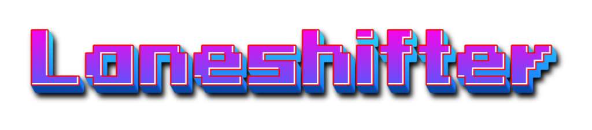

# What is Laneshifter? ✨

Laneshift is a 2D endless runner, which was created as part of a course I was studying in which we had to develop a game that could only be controlled using the mouse wheel within a week.

# About the game 🎮

Laneshifter ist ein Endless runner game, dessen steuerung nur über das maurad stattfindet. Durch hoch scrollen, springt der spieler hoch, durch runter scrollen, springt der spieler runter. The entire game was realized with Unity using the universal render pipeline for authentic effects.

The game has a chunk based map generation. There are predefined chunks that can spawn randomly. As the player progresses, the pool of possible spawnable chunks increases. The game speed also increases. However, the player receives small checkpoints after different sections. Here the player stops and has the opportunity to buy upgrades with the money earned during the run.

